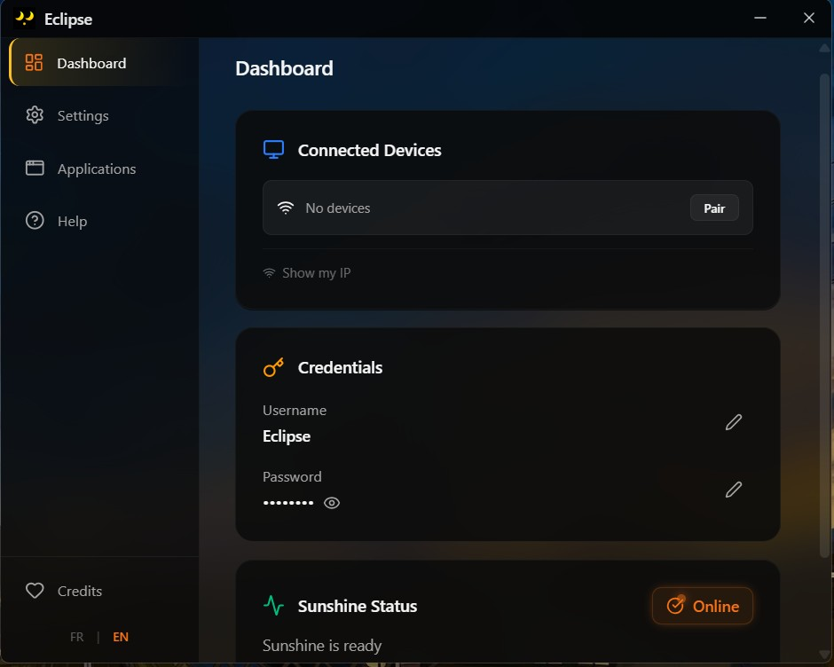
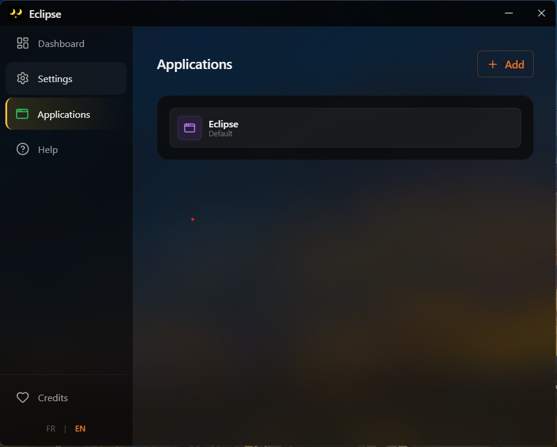

<p align="center">
  
</p>

<h1 align="center">Eclipse</h1>

<p align="center">
  <strong>All-in-one control panel for Sunshine — displays, presets, apps & pairing.</strong>
  <br>
  Stream your PC to any screen with Moonlight, effortlessly.
</p>

<p align="center">
  <a href="https://github.com/Eclipse-Stream/Eclipse/releases">Download</a> &bull;
  <a href="https://discord.gg/RTAQlQzm">Discord</a> &bull;
  <a href="#features">Features</a> &bull;
  <a href="#installation">Installation</a>
</p>

---

## What is Eclipse?

Eclipse is a **Windows desktop application** that acts as a complete control panel for [Sunshine](https://github.com/LizardByte/Sunshine), the open-source game streaming server for [Moonlight](https://moonlight-stream.org/).

**The problem:** Sunshine is powerful but complex to configure. Managing virtual displays, screen presets, resolution settings, and streaming configs requires editing config files manually.

**The solution:** Eclipse gives you a clean UI to manage everything — virtual displays, Sunshine presets, client pairing, application management — all in one place.

## Features

- **Dashboard** - Real-time Sunshine status monitoring, one-click start/stop/restart
- **Virtual Display Driver** - Enable/disable virtual displays, set resolution & refresh rate, automatic GUID detection
- **Sunshine Presets** - Create, apply, and switch between streaming configurations (display, audio, network, inputs)
- **Application Management** - Add/edit/remove apps visible in Moonlight with automatic prep-cmd generation
- **Client Management** - View connected Moonlight clients, pair new devices with PIN, unpair
- **System Tray** - Quick access to common actions without opening the full app
- **Network Diagnostics** - Built-in tools to troubleshoot connectivity issues
- **Multi-language** - French & English

## Screenshots

<p align="center">
  
</p>

<p align="center">
  
  
</p>

<p align="center">
  
</p>

<details>
<summary>System Tray</summary>

<p align="center">
  
  
</p>

</details>

## Installation

### Download the installer

1. Go to [Releases](https://github.com/Eclipse-Stream/Eclipse/releases)
2. Download `Eclipse-Setup-x.x.x.exe`
3. Run the installer (requires Administrator privileges for VDD driver)
4. Launch Eclipse from the Start Menu or Desktop shortcut

### What gets installed

- **Eclipse** application
- **Sunshine** (portable, bundled — no separate install needed)
- **Virtual Display Driver** (MttVDD, installed on first use)
- **ViGEmBus** (gamepad support for streaming)
- Windows Firewall rules for Sunshine

### System Requirements

- Windows 10/11 (64-bit)
- A GPU (AMD, Intel, or NVIDIA) for hardware encoding
- [Moonlight](https://moonlight-stream.org/) on the device you want to stream to

## Build from source

```powershell
# Clone the repository
git clone https://github.com/Eclipse-Stream/Eclipse.git
cd Eclipse/app

# Install dependencies
npm install

# Run in development mode
npm start

# Build the installer
npm run dist
```

## Tech Stack

- **Electron** + **Vite** + **TypeScript**
- **React 19** + **Tailwind CSS** + **shadcn/ui**
- **Zustand** for state management
- **Zod** for runtime validation
- Clean Architecture (Domain / Application / Infrastructure / UI)

## Contributing

Contributions are welcome! All changes go through Pull Requests and are reviewed by maintainers before being merged.

1. Fork the repository
2. Create a feature branch (`git checkout -b feature/my-feature`)
3. Commit your changes
4. Push to your fork
5. Open a Pull Request with a clear description of what you changed and why

Please open an issue first to discuss significant changes before starting work.

## License

This project is licensed under the **GNU General Public License v3.0** — see the [LICENSE](LICENSE) file for details.

Eclipse bundles [Sunshine](https://github.com/LizardByte/Sunshine) (GPL-3.0) and uses [Moonlight](https://moonlight-stream.org/) (GPL-3.0) as its streaming client.

## Acknowledgments

- [LizardByte/Sunshine](https://github.com/LizardByte/Sunshine) - The streaming server that makes this possible
- [Moonlight](https://moonlight-stream.org/) - The streaming client
- [MttVDD](https://github.com/itsmikethetech/Virtual-Display-Driver) - Virtual Display Driver
- [NirSoft MultiMonitorTool](https://www.nirsoft.net/utils/multi_monitor_tool.html) - Multi-display management utility
